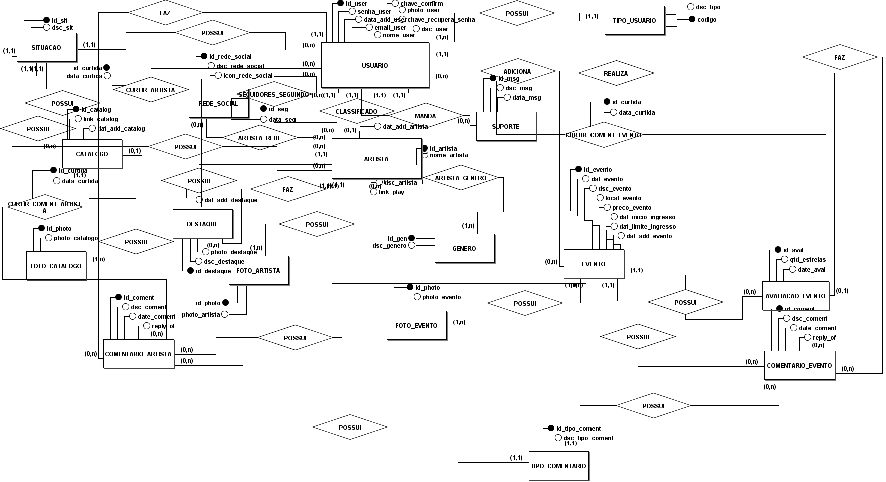
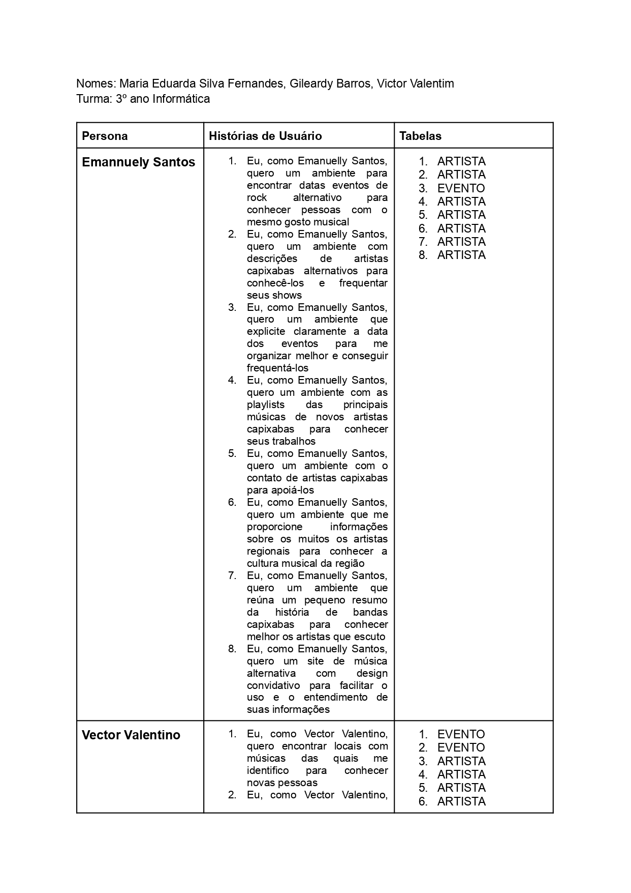
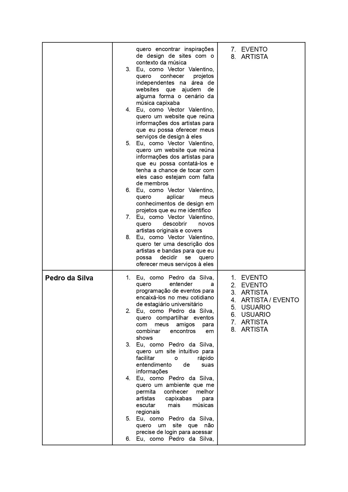
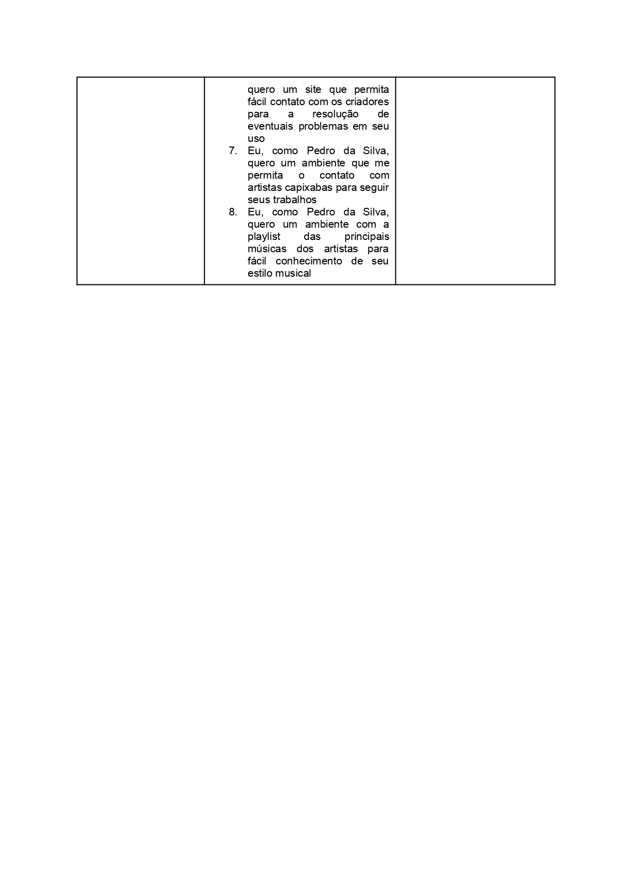
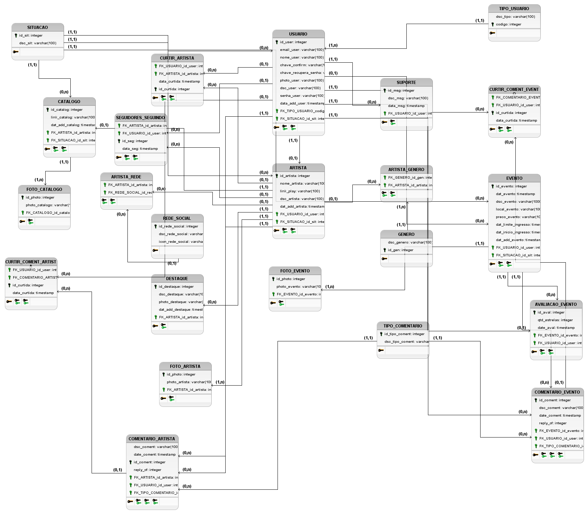

# TRABALHO DE PI: RockXaba
Trabalho desenvolvido durante a disciplina de Banco de Dados do Integrado

# Sumário

### 1. COMPONENTES 
Integrantes do grupo 
Maria Eduarda Silva Fernandes: dudinha140405@gmail.com 
Gileardy Barros da Silva: gileard96@gmail.com 
Victor Portes Antunes Valentim: walentim23@gmail.com

### 2.MINIMUNDO 

O usuário tem um id para identificá-lo, um email, uma senha e um nome de
usuário. Caso queira (de forma não obrigatória), ele poderá ser classificado como
um artista, sendo a ele atribuído um id de artista e, de acordo com sua escolha, um
nome de artista, um gênero musical, uma descrição de suas músicas e de sua
banda ou carreira solo. Assim, o cadastro de artista poderá ser deletado sem alterar
o cadastro do usuário. O artista também poderá adicionar uma playlist embed do
Spotify com suas músicas, tendo essa playlist um id e o próprio link embed. O artista
pode optar por possuir um catálogo, que é identificado por um id, onde
obrigatoriamente estão contidos seus produtos (pelo menos um), com os seguintes
atributos: id do produto, nome do produto, descrição do produto e preço do produto.
A compra do produto tem um determinado código de compra e uma data de compra,
podendo ser realizada apenas por usuários do site (com cadastro, sendo esses
usuários artistas ou não). Não há limite na quantidade de produtos requerida pelo
usuário, além do estabelecido pela quantia em estoque.
 
### 3.PMC 

a) inclusão do PMC desenvolvido pelo grupo  

 

### 4.Personas e Histórias de usuário 

a) inclusão das Personas desenvolvidas pelo grupo 

 

 
 

 
 

 

b) inclusão das Histórias de usuário desenvolvidas pelo grupo 

 

 

 

### 5.RASCUNHOS BÁSICOS DA INTERFACE (MOCKUPS) 
 
 

 

 

 

 

 

 

 

 

 

 

 

 

 

#### 5.1 QUAIS PERGUNTAS PODEM SER RESPONDIDAS COM O SISTEMA PROPOSTO?

    a) O sistema proposto poderá fornecer quais tipos de relatórios e informações?
    
    O sistema proposto poderá fornecer relatórios e informações com relação ao usuário, seu nome, seu email, sua senha, o id a ele atribuido, e seu tipo 
    dentro do site (podendo ser comum, artista, administrador). Poderá também fornecer relatórios quanto ao número de artistas,
    seu nome, gênero musical, descrição, playlist e catálogo, e os produtos que nele estão. Pode fornecer relatórios referentes aos produtos comprados, 
    e aos  eventos adicionados ao site
    
    b) Crie uma lista com os 5 principais relatórios que poderão ser obtidos por meio do sistema proposto!
   * Relatório com a quantidade de usuários cadastrados no site, incluindo as seguintes informações: id do usuário, nome, email, senha e tipo
   * Relatório com a quantidade de artistas cadastrados no site, incluindo as seguintes informações: id do artista, nome, descrição, gênero musical e link de    sua playlist de músicas e id do usuário ligado a ele
   * Relatório do número de catálogos de artistas cadastrados no site, incluindo as seguintes informações: id do catálogo e id do artista ao qual ele            pertence
   * Relatório do número de produtos presentes em cada catálogo e daqueles que foram comprados, incluindo as seguintes informações: id do produto, nome do      produto, descrição do produto, preço do produto, código da compra e data da compra
   * Relatório dos eventos adicionados ao site, incluindo as seguintes informações: id do evento, data do evento, descrição do evento, local do evento,          descrição do evento, data do início da venda dos ingressos e data limite da venda de ingressos
 

### 6. TABELA DE DADOS DO SISTEMA:
    
  ### Link da tabela
  https://docs.google.com/spreadsheets/d/1qAd4MRqutDYQ0STj_ZWVn1yk-ysUNSTcT1-sfBa1qvo/edit?usp=sharing
  
 

 

 
 
 ### 7.MODELO CONCEITUAL 
    
     Principais entidades do sistema em desenvolvimento: Usuário, Artista e Evento
     
     Principais fluxos: Evento e Artista
 
 
      
    
#### 7.1 Descrição dos dados 
    
USUÁRIO: Tabela que armazena os dados do usuário. 
id_user: campo que armazena o id do usuário.  
senha_user: campo que armazena a senha do usuário.  
email_user: campo que armazena o email do usuário.  
nome_user: campo que armazena o nome do usuário.  
FK_TIPO_USUARIO_codigo: campo que armazena e determina o tipo de usuário.  
FK_SITUACAO_id_sit: campo que determina a situação do usuário (Ativo, Inativo)  
data_add_user: campo que armazena a data em que o usuário foi cadastrado no site  
chave_confirm: campo que armazena a chave de confirmação do cadastro do usuário  
chave_recupera_senha: campo que armazena a chave de recuperação de senha do usuário  
photo_user: campo que armazena a foto do usuário.
 

TIPO_USUÁRIO: Tabela que armazena os tipos de usuário.  
codigo: campo que armazena o código referente a cada tipo de usuário.  
dsc_tipo: descrição do tipo de usuário.  

ARTISTA: Tabela que armazena os dados do artista.  
id_artista: campo que armazena o id do artista.     
nome_artista: campo que armazena o nome do artista.   
dsc_artista: campo que armazena a descrição do artista.   
link_play: campo que armazena o link para o Spotify do artista.  
dat_add_artista: data em que o artista foi adicionado
FK_USUARIO_id_user: chave estrangeira referente ao tipo de usuário.  
FK_SITUACAO_id_sit: chave estrangeira referente à situação de usuário  

ARTISTA_GENERO: Tabela que relaciona um artista a um gênero. 
FK_GENERO_id_gen: chave estrangeira com o gênero musical.     
FK_ARTISTA_id_artista: chave estrangeira com o id do artista. 

GENERO: Tabela que armazena o id e gênero musical dos artistas.  
id_gen: campo que armazena o id referente ao gênero. 
dsc_gen: campo que armazena a descrição do gênero. 

CATALOGO: Tabela que armazena o catálogo referente a cada artista. 
id_catalog: campo que armazena o id do catálogo.  
link_catalog: campo que armazena o link do catálogo que levará à loja do Artista.  
dat_add_catalog: campo que armazena a data em que o catálogo foi adicionado ao site.  
FK_ARTISTA_id_artista: chave estrangeira que armazena o id do artista.  
FK_SITUACAO_id_sit: campo que armazena a situação do catálogo (Ativo, Inativo).  

FOTO_CATALOGO: Tabela que armazena as fotos presentes no catálogo.  
photo_catalog: campo que armazena a foto do catálogo (o endereço).  
FK_CATALOGO_id_catalog: chave estrangeira referente ao catálogo.  

EVENTO: Tabela que armazena os dados do evento.  
id_evento: campo que armazena o id do evento.   
dat_evento: campo que armazena a data do evento.     
dsc_evento: campo que armazena a descrição do evento.  
local_evento: campo que armazena    o local do evento.  
preco_evento: campo que armazena     o preço do ingresso.  
dat_limite_ingresso: campo que armazena a data final da venda do ingresso.  
dat_inicio_ingresso: campo que armazena a data inicial da venda do ingresso.  
dat_add_evento: campo que armazena a data em que o evento foi adicionado ao site.  
FK_USUARIO_id_user: chave estrangeira relativa ao id do usuário que adicionou o evento.  
FK_SITUACAO_id_sit: chave estrangeira referente à situação do evento no site (Ativo, Inativo).  

CURITR_ARTISTA: tabela que armazena as curtidas dos Artistas.  
id_curtida: campo que armazena o id da curtida.  
data_curtida: campo que armazena a data da curtida.  
FK_USUARIO_id_user: chave estrangeira referente ao id do usuário que fez a curtida.  
FK_ARTISTA_id_artista: chave estrangeira referente ao id do Artista que foi curtido.  

SEGUIDORES_SEGUINDO: tabela que armazena os seguidores e aqueles que são seguidos.  
id_seg: campo que armazena o id da 'seguida'.  
data_seg: data em que o Artista foi seguido.  
FK_ARTISTA_id_artista: chave estrangeira referente ao id do artista que foi seguido.  
FK_USUARIO_id_user: chave estrangeira do usuário que seguiu o Artista.  

REDE_SOCIAL: tabela que armazena às redes sociais linkadas ao site.  
id_rede_social: campo que armazena o id da rede social.  
dsc_rede_social: campo que armazena a descrição da rede social.  
icon_rede_social: campo que armazena o icon da rede social.  

ARTISTA_REDE: tabela que faz o intermédio entre o Artista e suas Redes Sociais.  
FK_ARTISTA_id_artista: chave estrangeira referente ao Artista que possui as redes.  
FK_REDE_SOCIAL: chave estrangeira referente à rede social.  

CURTIR_COMENT_ARTISTA: tabela que armazena as curtidas dos comentários na página de Artistas.  
id_curtida: campo que armazena o id da curtida.  
data_curtida: campo que armazena a data da curtida.  
FK_USUARIO_id_user: campo que armazena o id do usuário que fez a curtida.  
FK_COMENTARIO_ARTISTA: campo que armazena o id do comentário que foi curtido.  

CURTIR_COMENT_EVENTO: tabela que armazena as curtidas dos comentários na página de Eventos.  
id_curtida: campo que armazena o id da curtida.  
data_curtida: campo que armazena a data da curtida.  
FK_USUARIO_id_user: campo que armazena o id do usuário que fez a curtida.  
FK_COMENTARIO_EVENTO: campo que armazena o id do comentário que foi curtido.  

DESTAQUE: tabela que armazena os destaques da página de Artista.  
id_destaque: campo que armazena o id do destaque.  
dsc_destaque: campo que armazena o texto do destaque.  
photo_destaque: campo que armazena uma imagem do destaque.  
dat_add_destaque: campo que armazena a data em que o destaque foi adicionado.  
FK_ARTISTA_id_artista: chave estrangeira referente ao Artista em que a página está o destaque.  

FOTO_EVENTO: tabela que armazena as fotos ligadas aos Eventos.  
id_photo: campo que armazena o id da foto.  
photo_evento: campo que armazena o endereço da foto.  
FK_EVENTO_id_evento: campo que armzena o id do evento ao qual à foto está ligada.  

COMENTARIO_ARTISTA: tabela que armazena os comentários na página de Artista.  
id_coment: campo que armazena o id do comentário.  
dsc_coment: campo que armazena o texto do comentário.  
date_coment: campo que armazena a data do comentário.  
reply_of: campo que armazena o id do comentário a quem está respondendo (se for uma resposta).  
FK_ARTISTA_id_artista: chave estrangeira referente ao Artista que recebeu o comentário.  
FK_USUARIO_id_user: chave estrangeira referente ao id do usuário que fez o comentário.  
FK_TIPO_COMENTARIO_id_tipo: chave estrangeira referente ao id do tipo de comentário.  

COMENTARIO_EVENTO: tabela que armazena os comentários na página de Evento.  
id_coment: campo que armazena o id do comentário.  
dsc_coment: campo que armazena o texto do comentário.  
date_coment: campo que armazena a data do comentário.  
reply_of: campo que armazena o id do comentário a quem está respondendo (se for uma resposta).  
FK_EVENTO_id_evento: chave estrangeira referente ao Evento que recebeu o comentário.  
FK_USUARIO_id_user: chave estrangeira referente ao id do usuário que fez o comentário.  
FK_TIPO_COMENTARIO_id_tipo: chave estrangeira referente ao id do tipo de comentário.  

TIPO_COMENTARIO: tabela que armazena os tipos de comentário.  
id_tipo_coment: campo que armazena o id do tipo de comentário.  
dsc_tipo_coment: campo que armazena a descrição do tipo de comentário.  

SUPORTE: tabela que armazena as mensagens enviadas no Suporte.  
id_msg: campo que armazena o id da mensagem.  
dsc_msg: campo que armazena o texto da mensagem de Suporte.  
data_msg: campo que armazena a data em que a mensagem foi enviada.  
FK_USUARIO_id_user: chave estrangeira referente ao id do usuário que enviou a mensagem.  

ARTISTA_GENERO: tabela intermediária entre os Artistas e os Gêneros.  
FK_GENERO_id_gen: chave estrangeira referente ao id do gênero.  
FK_ARTISTA_id_artista: chave estrangeira referente ao id do Artista.  

AVALIACAO_EVENTO: tabela que armazena as avaliações dos Eventos.  
id_aval: campo que armazena o id da avaliação.  
qtd_estrelas: campo que armazena a quantidade de estrelas da avaliação.  
date_aval: campo que armazena a data em que a avaliação foi feita.  
FK_EVENTO_id_evento: chave estrangeira referente ao id do Evento que foi avaliado.  
FK_USUARIO_id_user: chave estrangeira referente ao usuário que fez a avaliação.  

### 8	RASTREABILIDADE DOS ARTEFATOS 
        a) Historia de usuários vs protótipo (mockup)
        
    
        

        
    
        
    
        
        
        b) Protótipo vs Modelo conceitual
    
        

        
    
        

        
    
        

        
        (não serão aceitos modelos que não estejam em conformidade)
        c) Backlog (caso solicitado)
        
   

### 9	MODELO LÓGICO 

        a) inclusão do esquema lógico do banco de dados
        
   "
        
        b) verificação de correspondencia com o modelo conceitual 
        (não serão aceitos modelos que não estejam em conformidade)

### 10	MODELO FÍSICO 
        a) inclusão das instruções de criacão das estruturas em SQL/DDL 
        
/* Físico_16_09: */

CREATE TABLE USUARIO (
    id_user integer PRIMARY KEY,
    email_user varchar(100),
    nome_user varchar(100),
    chave_confirm varchar(100),
    chave_recupera_senha varchar(100),
    photo_user varchar(100),
    dsc_user varchar(100),
    senha_user varchar(100),
    data_add_user timestamp,
    FK_TIPO_USUARIO_codigo integer,
    FK_SITUACAO_id_sit integer
);

CREATE TABLE ARTISTA (
    id_artista integer PRIMARY KEY,
    nome_artista varchar(100),
    link_play varchar(100),
    dsc_artista varchar(100),
    dat_add_artista timestamp,
    FK_USUARIO_id_user integer,
    FK_SITUACAO_id_sit integer
);

CREATE TABLE CATALOGO (
    id_catalog integer PRIMARY KEY,
    link_catalog varchar(100),
    dat_add_catalog timestamp,
    FK_ARTISTA_id_artista integer,
    FK_SITUACAO_id_sit integer
);

CREATE TABLE EVENTO (
    id_evento integer PRIMARY KEY,
    dat_evento timestamp,
    dsc_evento varchar(1000),
    local_evento varchar(100),
    preco_evento varchar(100),
    dat_limite_ingresso timestamp,
    dat_inicio_ingresso timestamp,
    dat_add_evento timestamp,
    FK_USUARIO_id_user integer,
    FK_SITUACAO_id_sit integer
);

CREATE TABLE TIPO_USUARIO (
    dsc_tipo varchar(100),
    codigo integer PRIMARY KEY
);

CREATE TABLE GENERO (
    dsc_genero varchar(100),
    id_gen integer PRIMARY KEY
);

CREATE TABLE COMENTARIO_EVENTO (
    id_coment integer PRIMARY KEY,
    dsc_coment varchar(100),
    date_coment timestamp,
    reply_of integer,
    FK_EVENTO_id_evento integer,
    FK_USUARIO_id_user integer,
    FK_TIPO_COMENTARIO_id_tipo_coment integer
);

CREATE TABLE AVALIACAO_EVENTO (
    id_aval integer PRIMARY KEY,
    qtd_estrelas integer,
    date_aval timestamp,
    FK_EVENTO_id_evento integer,
    FK_USUARIO_id_user integer
);

CREATE TABLE FOTO_EVENTO (
    id_photo integer PRIMARY KEY,
    photo_evento varchar(100),
    FK_EVENTO_id_evento integer
);

CREATE TABLE FOTO_ARTISTA (
    id_photo integer PRIMARY KEY,
    photo_artista varchar(100),
    FK_ARTISTA_id_artista integer
);

CREATE TABLE FOTO_CATALOGO (
    id_photo integer PRIMARY KEY,
    photo_catalogo varchar(100),
    FK_CATALOGO_id_catalog integer
);

CREATE TABLE COMENTARIO_ARTISTA (
    dsc_coment varchar(100),
    date_coment timestamp,
    id_coment integer PRIMARY KEY,
    reply_of integer,
    FK_ARTISTA_id_artista integer,
    FK_USUARIO_id_user integer,
    FK_TIPO_COMENTARIO_id_tipo_coment integer
);

CREATE TABLE TIPO_COMENTARIO (
    id_tipo_coment integer PRIMARY KEY,
    dsc_tipo_coment varchar(100)
);

CREATE TABLE SUPORTE (
    id_msg integer PRIMARY KEY,
    dsc_msg varchar(100),
    data_msg timestamp,
    FK_USUARIO_id_user integer
);

CREATE TABLE REDE_SOCIAL (
    id_rede_social integer PRIMARY KEY,
    dsc_rede_social varchar(100),
    icon_rede_social varchar(100)
);

CREATE TABLE DESTAQUE (
    id_destaque integer PRIMARY KEY,
    dsc_destaque varchar(100),
    photo_destaque varchar(100),
    dat_add_destaque timestamp,
    FK_ARTISTA_id_artista integer
);

CREATE TABLE SITUACAO (
    id_sit integer PRIMARY KEY,
    dsc_sit varchar(100)
);

CREATE TABLE ARTISTA_GENERO (
    FK_GENERO_id_gen integer,
    FK_ARTISTA_id_artista integer
);

CREATE TABLE SEGUIDORES_SEGUINDO (
    FK_ARTISTA_id_artista integer,
    FK_USUARIO_id_user integer,
    id_seg integer PRIMARY KEY,
    data_seg timestamp
);

CREATE TABLE CURTIR_ARTISTA (
    FK_USUARIO_id_user integer,
    FK_ARTISTA_id_artista integer,
    data_curtida timestamp,
    id_curtida integer PRIMARY KEY
);

CREATE TABLE ARTISTA_REDE (
    FK_ARTISTA_id_artista integer,
    FK_REDE_SOCIAL_id_rede_social integer
);

CREATE TABLE CURTIR_COMENT_ARTISTA (
    FK_USUARIO_id_user integer,
    FK_COMENTARIO_ARTISTA_id_coment integer,
    id_curtida integer PRIMARY KEY,
    data_curtida timestamp
);

CREATE TABLE CURTIR_COMENT_EVENTO (
    FK_COMENTARIO_EVENTO_id_coment integer,
    FK_USUARIO_id_user integer,
    id_curtida integer PRIMARY KEY,
    data_curtida timestamp
);
 
ALTER TABLE USUARIO ADD CONSTRAINT FK_USUARIO_2
    FOREIGN KEY (FK_TIPO_USUARIO_codigo)
    REFERENCES TIPO_USUARIO (codigo)
    ON DELETE RESTRICT;
 
ALTER TABLE USUARIO ADD CONSTRAINT FK_USUARIO_3
    FOREIGN KEY (FK_SITUACAO_id_sit)
    REFERENCES SITUACAO (id_sit)
    ON DELETE CASCADE;
 
ALTER TABLE ARTISTA ADD CONSTRAINT FK_ARTISTA_2
    FOREIGN KEY (FK_USUARIO_id_user)
    REFERENCES USUARIO (id_user)
    ON DELETE CASCADE;
 
ALTER TABLE ARTISTA ADD CONSTRAINT FK_ARTISTA_3
    FOREIGN KEY (FK_SITUACAO_id_sit)
    REFERENCES SITUACAO (id_sit)
    ON DELETE CASCADE;
 
ALTER TABLE CATALOGO ADD CONSTRAINT FK_CATALOGO_2
    FOREIGN KEY (FK_ARTISTA_id_artista)
    REFERENCES ARTISTA (id_artista)
    ON DELETE CASCADE;
 
ALTER TABLE CATALOGO ADD CONSTRAINT FK_CATALOGO_3
    FOREIGN KEY (FK_SITUACAO_id_sit)
    REFERENCES SITUACAO (id_sit)
    ON DELETE CASCADE;
 
ALTER TABLE EVENTO ADD CONSTRAINT FK_EVENTO_2
    FOREIGN KEY (FK_USUARIO_id_user)
    REFERENCES USUARIO (id_user)
    ON DELETE CASCADE;
 
ALTER TABLE EVENTO ADD CONSTRAINT FK_EVENTO_3
    FOREIGN KEY (FK_SITUACAO_id_sit)
    REFERENCES SITUACAO (id_sit)
    ON DELETE CASCADE;
 
ALTER TABLE COMENTARIO_EVENTO ADD CONSTRAINT FK_COMENTARIO_EVENTO_2
    FOREIGN KEY (FK_EVENTO_id_evento)
    REFERENCES EVENTO (id_evento)
    ON DELETE CASCADE;
 
ALTER TABLE COMENTARIO_EVENTO ADD CONSTRAINT FK_COMENTARIO_EVENTO_3
    FOREIGN KEY (FK_USUARIO_id_user)
    REFERENCES USUARIO (id_user)
    ON DELETE CASCADE;
 
ALTER TABLE COMENTARIO_EVENTO ADD CONSTRAINT FK_COMENTARIO_EVENTO_4
    FOREIGN KEY (FK_TIPO_COMENTARIO_id_tipo_coment)
    REFERENCES TIPO_COMENTARIO (id_tipo_coment)
    ON DELETE CASCADE;
 
ALTER TABLE AVALIACAO_EVENTO ADD CONSTRAINT FK_AVALIACAO_EVENTO_2
    FOREIGN KEY (FK_EVENTO_id_evento)
    REFERENCES EVENTO (id_evento)
    ON DELETE CASCADE;
 
ALTER TABLE AVALIACAO_EVENTO ADD CONSTRAINT FK_AVALIACAO_EVENTO_3
    FOREIGN KEY (FK_USUARIO_id_user)
    REFERENCES USUARIO (id_user)
    ON DELETE CASCADE;
 
ALTER TABLE FOTO_EVENTO ADD CONSTRAINT FK_FOTO_EVENTO_2
    FOREIGN KEY (FK_EVENTO_id_evento)
    REFERENCES EVENTO (id_evento)
    ON DELETE RESTRICT;
 
ALTER TABLE FOTO_ARTISTA ADD CONSTRAINT FK_FOTO_ARTISTA_2
    FOREIGN KEY (FK_ARTISTA_id_artista)
    REFERENCES ARTISTA (id_artista)
    ON DELETE RESTRICT;
 
ALTER TABLE FOTO_CATALOGO ADD CONSTRAINT FK_FOTO_CATALOGO_2
    FOREIGN KEY (FK_CATALOGO_id_catalog)
    REFERENCES CATALOGO (id_catalog)
    ON DELETE RESTRICT;
 
ALTER TABLE COMENTARIO_ARTISTA ADD CONSTRAINT FK_COMENTARIO_ARTISTA_2
    FOREIGN KEY (FK_ARTISTA_id_artista)
    REFERENCES ARTISTA (id_artista)
    ON DELETE CASCADE;
 
ALTER TABLE COMENTARIO_ARTISTA ADD CONSTRAINT FK_COMENTARIO_ARTISTA_3
    FOREIGN KEY (FK_USUARIO_id_user)
    REFERENCES USUARIO (id_user)
    ON DELETE CASCADE;
 
ALTER TABLE COMENTARIO_ARTISTA ADD CONSTRAINT FK_COMENTARIO_ARTISTA_4
    FOREIGN KEY (FK_TIPO_COMENTARIO_id_tipo_coment)
    REFERENCES TIPO_COMENTARIO (id_tipo_coment)
    ON DELETE CASCADE;
 
ALTER TABLE SUPORTE ADD CONSTRAINT FK_SUPORTE_2
    FOREIGN KEY (FK_USUARIO_id_user)
    REFERENCES USUARIO (id_user)
    ON DELETE CASCADE;
 
ALTER TABLE DESTAQUE ADD CONSTRAINT FK_DESTAQUE_2
    FOREIGN KEY (FK_ARTISTA_id_artista)
    REFERENCES ARTISTA (id_artista)
    ON DELETE CASCADE;
 
ALTER TABLE ARTISTA_GENERO ADD CONSTRAINT FK_ARTISTA_GENERO_1
    FOREIGN KEY (FK_GENERO_id_gen)
    REFERENCES GENERO (id_gen)
    ON DELETE RESTRICT;
 
ALTER TABLE ARTISTA_GENERO ADD CONSTRAINT FK_ARTISTA_GENERO_2
    FOREIGN KEY (FK_ARTISTA_id_artista)
    REFERENCES ARTISTA (id_artista)
    ON DELETE SET NULL;
 
ALTER TABLE SEGUIDORES_SEGUINDO ADD CONSTRAINT FK_SEGUIDORES_SEGUINDO_2
    FOREIGN KEY (FK_ARTISTA_id_artista)
    REFERENCES ARTISTA (id_artista)
    ON DELETE SET NULL;
 
ALTER TABLE SEGUIDORES_SEGUINDO ADD CONSTRAINT FK_SEGUIDORES_SEGUINDO_3
    FOREIGN KEY (FK_USUARIO_id_user)
    REFERENCES USUARIO (id_user)
    ON DELETE SET NULL;
 
ALTER TABLE CURTIR_ARTISTA ADD CONSTRAINT FK_CURTIR_ARTISTA_2
    FOREIGN KEY (FK_USUARIO_id_user)
    REFERENCES USUARIO (id_user)
    ON DELETE SET NULL;
 
ALTER TABLE CURTIR_ARTISTA ADD CONSTRAINT FK_CURTIR_ARTISTA_3
    FOREIGN KEY (FK_ARTISTA_id_artista)
    REFERENCES ARTISTA (id_artista)
    ON DELETE SET NULL;
 
ALTER TABLE ARTISTA_REDE ADD CONSTRAINT FK_ARTISTA_REDE_1
    FOREIGN KEY (FK_ARTISTA_id_artista)
    REFERENCES ARTISTA (id_artista)
    ON DELETE SET NULL;
 
ALTER TABLE ARTISTA_REDE ADD CONSTRAINT FK_ARTISTA_REDE_2
    FOREIGN KEY (FK_REDE_SOCIAL_id_rede_social)
    REFERENCES REDE_SOCIAL (id_rede_social)
    ON DELETE SET NULL;
 
ALTER TABLE CURTIR_COMENT_ARTISTA ADD CONSTRAINT FK_CURTIR_COMENT_ARTISTA_2
    FOREIGN KEY (FK_USUARIO_id_user)
    REFERENCES USUARIO (id_user)
    ON DELETE SET NULL;
 
ALTER TABLE CURTIR_COMENT_ARTISTA ADD CONSTRAINT FK_CURTIR_COMENT_ARTISTA_3
    FOREIGN KEY (FK_COMENTARIO_ARTISTA_id_coment)
    REFERENCES COMENTARIO_ARTISTA (id_coment)
    ON DELETE SET NULL;
 
ALTER TABLE CURTIR_COMENT_EVENTO ADD CONSTRAINT FK_CURTIR_COMENT_EVENTO_2
    FOREIGN KEY (FK_COMENTARIO_EVENTO_id_coment)
    REFERENCES COMENTARIO_EVENTO (id_coment)
    ON DELETE SET NULL;
 
ALTER TABLE CURTIR_COMENT_EVENTO ADD CONSTRAINT FK_CURTIR_COMENT_EVENTO_3
    FOREIGN KEY (FK_USUARIO_id_user)
    REFERENCES USUARIO (id_user)
    ON DELETE SET NULL;
        
        (criação de tabelas, alterações, etc..) 
       
### 11	INSERT APLICADO NAS TABELAS DO BANCO DE DADOS 
        a) inclusão das instruções de inserção dos dados nas tabelas criadas pelo script de modelo físico
        (Drop para exclusão de tabelas + create definição de para tabelas e estruturas de dados 
          + insert para dados a serem inseridos)        
        
USE rockxaba;

DROP TABLE IF EXISTS `artista_genero`;

DROP TABLE IF EXISTS `compra`;

DROP TABLE IF EXISTS `produto`;

DROP TABLE IF EXISTS `catalogo`;

DROP TABLE IF EXISTS `artista`;

DROP TABLE IF EXISTS `evento`;

DROP TABLE IF EXISTS `genero`;

DROP TABLE IF EXISTS `usuario`;

DROP TABLE IF EXISTS `tipo_usuario`;

CREATE TABLE USUARIO ( id_user integer PRIMARY KEY, senha_user varchar(100), email_user varchar(100), nome_user varchar(100), FK_TIPO_USUARIO_codigo integer );

CREATE TABLE ARTISTA ( id_artista integer PRIMARY KEY, nome_artista varchar(100), dsc_artista varchar(100), link_play varchar(100), FK_USUARIO_id_user integer );

CREATE TABLE CATALOGO ( id_catalog integer PRIMARY KEY, FK_ARTISTA_id_artista integer );

CREATE TABLE PRODUTO ( id_produto integer PRIMARY KEY, nome_produto varchar(100), dsc_produto varchar(100), preco_produto varchar(100), FK_CATALOGO_id_catalog integer );

CREATE TABLE EVENTO ( id_evento integer PRIMARY KEY, dat_evento date, dsc_evento varchar(1000), local_evento varchar(100), preco_evento varchar(100), dat_limite_ingresso date, dat_inicio_ingresso date, FK_USUARIO_id_user integer );

CREATE TABLE TIPO_USUARIO ( codigo integer PRIMARY KEY, dsc_tipo varchar(1000) );

CREATE TABLE GENERO ( id_gen integer PRIMARY KEY, dsc_genero varchar(1000) );

CREATE TABLE COMPRA ( FK_PRODUTO_id_produto integer, FK_USUARIO_id_user integer, cod_compra integer PRIMARY KEY, data_compra varchar(100) );

CREATE TABLE ARTISTA_GENERO ( FK_GENERO_id_gen integer, FK_ARTISTA_id_artista integer );

insert into tipo_usuario(codigo, dsc_tipo) values  ('1',	'Comum'),
('2',	'Artista'),
('3',	'Administrador'),
('4',	'Administrador_Artista');

insert into usuario (id_user, senha_user, email_user, nome_user, FK_TIPO_USUARIO_codigo) values 
('1836',' VVD41BQO8RP', 'alladin@gmail.com', 'Aladdin Berg', '2'),
('2147',' OBX41KGM0FW', 	'orla@gmail.com,' , 'Orla Dutra','2'),
('2979',' CLM98NTK6XW', 	'derek@gmail.com', 'Derek Cabral','2'),
('6588',' PZQ51TZC8WK', 	'scarlett@gmail.com', 'Scarlett Braga','1'),
('6851',' WOD36JKB8ER', 	'branden@gmail.com', 'Branden Bryan','3'),
('7349', 'KNS43UPJ8NF',	'lucius@gmail.com', 'Lucius Farrell','2'),
('7885', 'UKO93LWT5WX', 'germane@gmail.com', 'Germane Bento','2'),
('8139', 'ONR04LAE4RQ',	 'daphne@gmail.com', 'Daphne Clayton','4'),
('8685	', 'XGN79WCL6FY',	'sigourney@gmail.com', 'Sigourney Moreno','4'),
('9264',' TEM15SBR7EJ',		'tatum@gmail.com', 'Tatum Barros','2');

insert into genero (id_gen, dsc_genero) values 
('1',	'Pop'),
('2',	'Blues'),
('3',	'Indie'),
('4',	'Forrô'),
('5',	'Folk'),
('6',	'Funk'),
('7',	'Eletrônica'),
('8',	'Punk');

insert into artista (id_artista, nome_artista, dsc_artista, link_play, FK_USUARIO_id_user) values
('2937',	'Jemima',	'Meu nome é Jemima, eu toco Blues',		'http://spotify.com',	 '9264'),
('2979',	'Griffith',	'Meu nome é Griffith, eu toco Indie',		'http://spotify.com',		 '2147'),
('3041',	'Zephr',	'Meu nome é Zephr, eu toco Forrô',		'http://spotify.com',		'7885'),
('3385',	'Porter',	'Meu nome é Porter, eu toco Folk',		'http://spotify.com',		 '7349'),
('4762',	',Kasper',	'Meu nome é Kasper, eu toco Funk',		'http://spotify.com',		 '8685'),
('5782',	'Lareina',	'Meu nome é Lareina, eu toco Eletrônica',		'http://spotify.com',		' 8139'),
('6589',	'Miranda',	'Meu nome é Miranda, eu toco Punk',		'http://spotify.com',		 '2979'),
('7885',	'Galvin',	'Meu nome é Galvin, eu toco Funk',		'http://spotify.com',		'1836');

insert into catalogo (id_catalog, fk_artista_id_artista) values 
('1262',	'2979'),
('6349',	'3041'),
('9550',	'3385'),
('5426',	'4762'),
('9399',	'5782'),
('6320',	'6589');

insert into produto (id_produto, nome_produto, dsc_produto, preco_produto, FK_CATALOGo_id_catalog) values
('4321',	'Caneca Indie',	'Caneca Indie',	'50',	'1262'),
('2022',	'Caneca Forrô',	'Caneca Forrô',	'100',	'6349'),
('3455',	'Camisa Folk',	'Camisa Folk',	'40',	'9550'),
('1789',	'Caneca Funk',	'Caneca Funk',	'120',	'5426'),
('9080',	'Camisa Eletrônica',	'Camisa Eletrônica',	'150',	'9399'),
('1000',	'Caneca Punk',	'Caneca Punk',	'50',	'6320');

insert into compra (FK_PRODUTO_id_produto, FK_USUARIO_id_user, cod_compra, data_compra) values
('9080', '2147',		'9800',	'2022/08/09'),
('1000', '7885	',	'4700',	'2022/05/06'),
('4321', '7349',		'1234',	'2022/09/06'),
('3455', '8685',	'2140',	'2022/12/06');

insert into evento (id_evento, dat_evento, dsc_evento, local_evento, preco_evento, dat_limite_ingresso, dat_inicio_ingresso, FK_USUARIO_id_user) values
('2040',	'2022-07-08',	'Casa de Show Rogers',	'Casa de Show Rogers',	'240',	'2022-07-02',	'2022-06-04',	'6851'),
('8000',	'2022-04-12',	'Casa de Show Nickels',	'Casa de Show Nickels',	'580',	'2022-04-10',	'2022-04-02',	'8139'),
('4080',	'2022-08-24',	'Casa de Show Tibre',	'Casa de Show Tibre',	'180',	'2022-08-15',	'2022-08-02',	'8685');

insert into artista_genero (FK_GENERO_id_gen, FK_ARTISTA_id_artista) values 
('2',	'2937'),
('3',	'2979'),
('4',	'3041'),
('5',	'3385'),
('6',	'4762'),
('7',	'5782'),
('8',	'6589'),
('6',	'7885');

        
        b) Criar um novo banco de dados para testar a restauracao 
        (em caso de falha na restauração o grupo não pontuará neste quesito)
        
  https://github.com/duda1404/rock_xaba_projeto_integrador/blob/7edd7acfa7c1d71daf870f318d9db9b6cde50b61/arquivos/rock_xaba.sql
      

### 12	TABELAS E PRINCIPAIS CONSULTAS 
    OBS: Incluir para cada tópico as instruções SQL + imagens (print da tela) mostrando os resultados. 
#### 12.1	CONSULTAS DAS TABELAS COM TODOS OS DADOS INSERIDOS (Todas)  
#### 12.2 PRINCIPAIS CONSULTAS DO SISTEMA 
 Inserir as principais consultas (relativas aos 5 principais relatórios) definidas previamente no iten 3.1 deste template.
  
  a) Você deve apresentar as consultas em formato SQL para cad um dos relatórios.
  
  b) Além da consulta deve ser apresentada uma imagem com o resultado obtido para cada consulta. 
 #### 12.3 ANTEPROJETO VERSÃO 1
 
 https://docs.google.com/document/d/1rqnJRio-i-UtDD3xdmRanwPloqc-fgYB/edit
 
  
  
 
 ### 13 Gráficos, relatórios, integração com Linguagem de programação e outras solicitações. 
     OBS: Observe as instruções relacionadas a cada uma das atividades abaixo. 
 #### 13.1	Integração com Linguagem de programação;  
 #### 13.2	Desenvolvimento de gráficos/relatórios pertinentes, juntamente com demais  
 #### solicitações feitas pelo professor.  
 #### 13.3 ANTEPROJETO VERSÃO 2
  
  
 
  ### 13.5 Calendário Reverso.  
  
   
 
 ### 14 Slides e Apresentação em vídeo.  
     OBS: Observe as instruções relacionadas a cada uma das atividades abaixo. 
 #### 14.1 Slides;  
 #### 14.2 Apresentação em vídeo  
 #### 14.3 ANTEPROJETO VERSÃO FINAL
  
     

    
##### About Formatting
    https://help.github.com/articles/about-writing-and-formatting-on-github/
    
##### Basic Formatting in Git
    
    https://help.github.com/articles/basic-writing-and-formatting-syntax/#referencing-issues-and-pull-requests
   
    
##### Working with advanced formatting
    https://help.github.com/articles/working-with-advanced-formatting/

#### Mastering Markdown
    https://guides.github.com/features/mastering-markdown/

### OBSERVAÇÕES IMPORTANTES

#### Todos os arquivos que fazem parte do projeto (Imagens, pdfs, arquivos fonte, etc..), devem estar presentes no GIT. Os arquivos do projeto vigente não devem ser armazenados em quaisquer outras plataformas.
1. Caso existam arquivos com conteúdos sigilosos, comunicar o professor que definirá em conjunto com o grupo a melhor forma de armazenamento do arquivo.

#### Todos os grupos deverão fazer Fork deste repositório e dar permissões administrativas ao usuário deste GIT, para acompanhamento do trabalho.

#### Os usuários criados no GIT devem possuir o nome de identificação do aluno (não serão aceitos nomes como Eu123, meuprojeto, pro456, etc). Em caso de dúvida comunicar o professor.

Link para BrModelo: 
http://sis4.com/brModelo/brModelo/download.html
 

Link para curso de GIT 

