# TRABALHO DE PI: RockXaba
Trabalho desenvolvido durante a disciplina de Banco de Dados do Integrado

# Sumário

### 1. COMPONENTES 
Integrantes do grupo 
Maria Eduarda Silva Fernandes: dudinha140405@gmail.com 
Gileardy Barros da Silva: gileard96@gmail.com 
Victor Portes Antunes Valentim: walentim23@gmail.com

### 2.MINIMUNDO 

O usuário tem um id para identificá-lo, um email, uma senha e um nome de
usuário. Caso queira (de forma não obrigatória), ele poderá ser classificado como
um artista, sendo a ele atribuído um id de artista e, de acordo com sua escolha, um
nome de artista, um gênero musical, uma descrição de suas músicas e de sua
banda ou carreira solo. Assim, o cadastro de artista poderá ser deletado sem alterar
o cadastro do usuário. O artista também poderá adicionar uma playlist embed do
Spotify com suas músicas, tendo essa playlist um id e o próprio link embed. O artista
pode optar por possuir um catálogo, que é identificado por um id, onde
obrigatoriamente estão contidos seus produtos (pelo menos um), com os seguintes
atributos: id do produto, nome do produto, descrição do produto e preço do produto.
A compra do produto tem um determinado código de compra e uma data de compra,
podendo ser realizada apenas por usuários do site (com cadastro, sendo esses
usuários artistas ou não). Não há limite na quantidade de produtos requerida pelo
usuário, além do estabelecido pela quantia em estoque.
 
### 3.PMC 

a) inclusão do PMC desenvolvido pelo grupo  

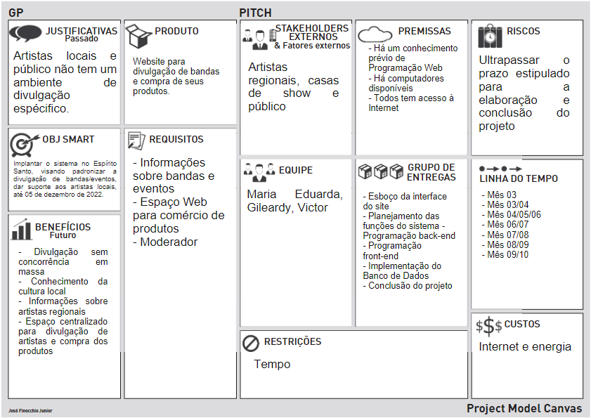 

### 4.Personas e Histórias de usuário 

a) inclusão das Personas desenvolvidas pelo grupo 

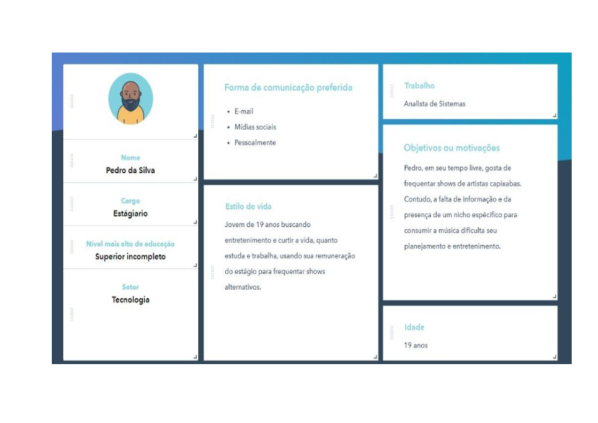 

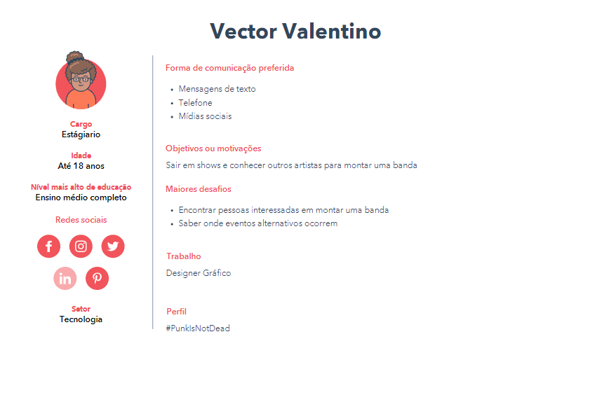 
 

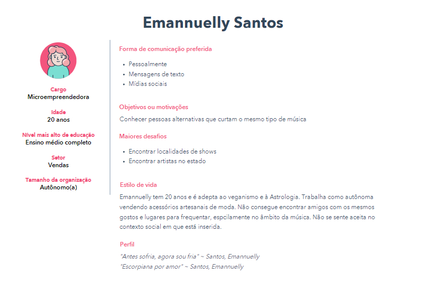 
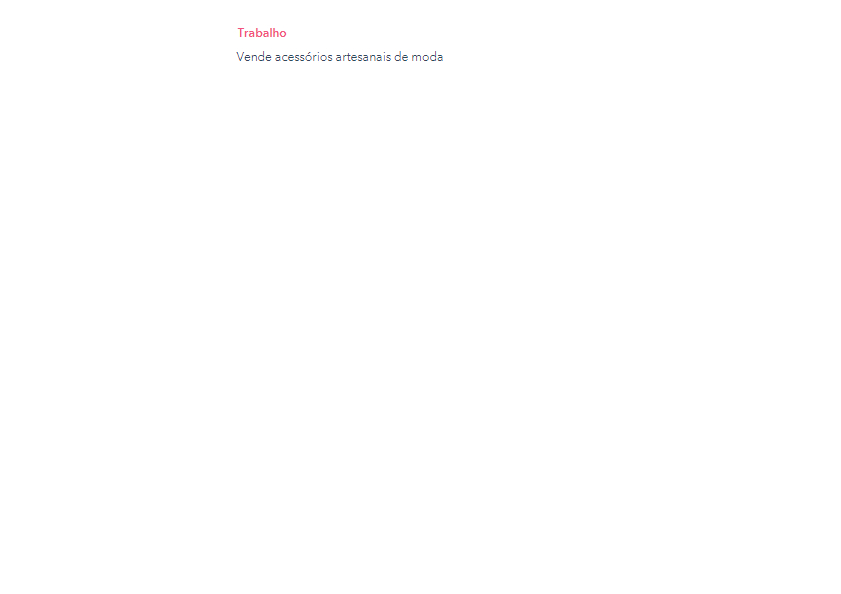 

 

b) inclusão das Histórias de usuário desenvolvidas pelo grupo 

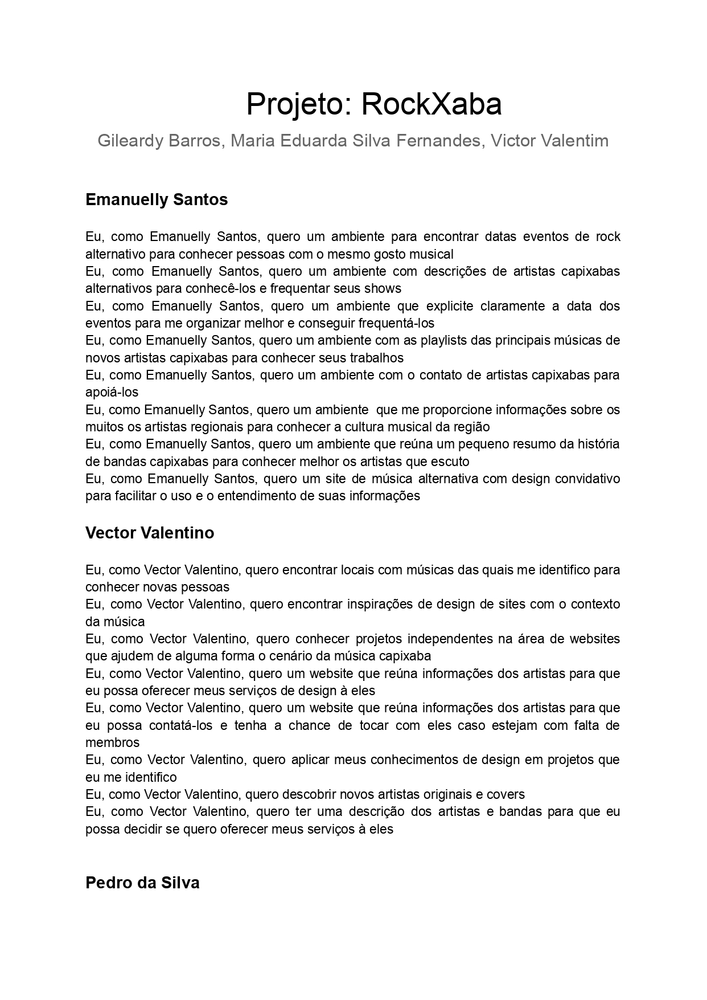 

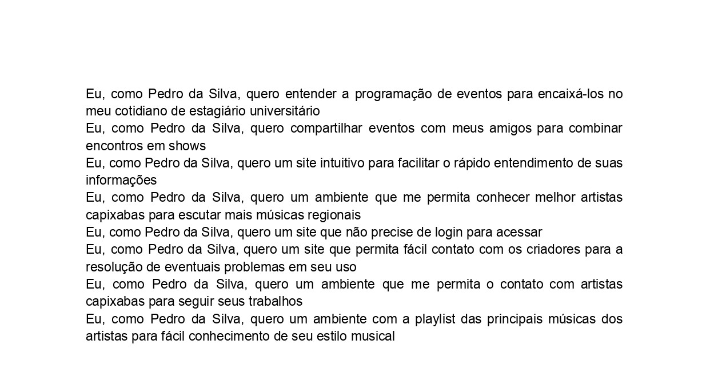 

 

### 5.RASCUNHOS BÁSICOS DA INTERFACE (MOCKUPS) 
 
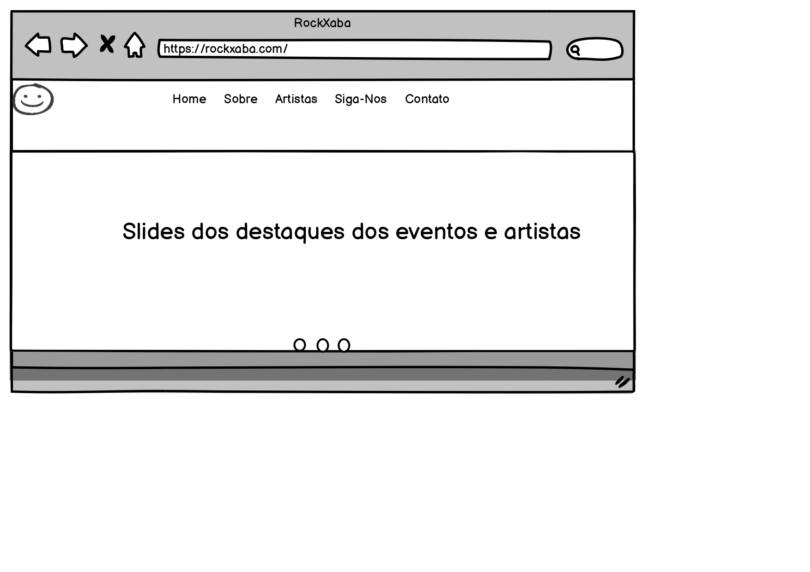 

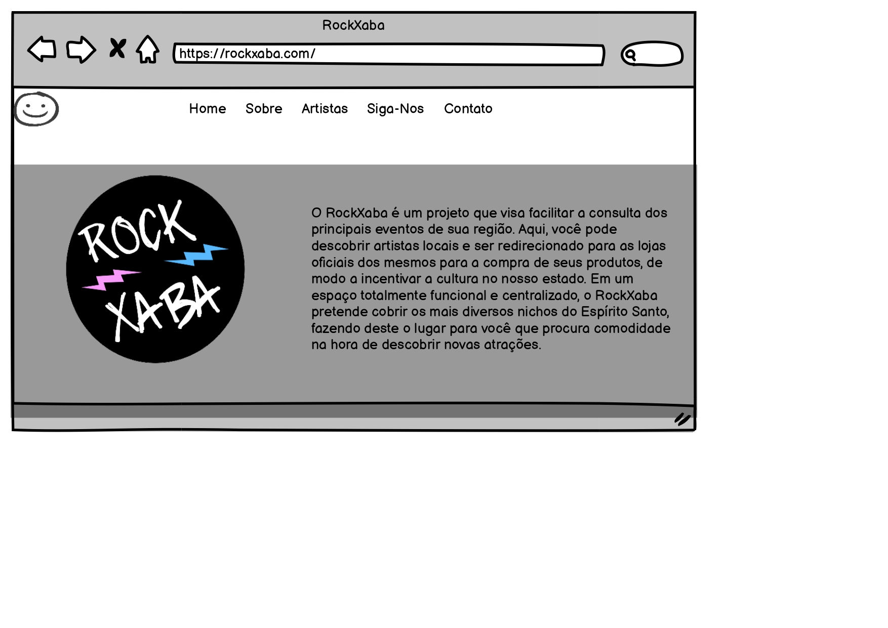 

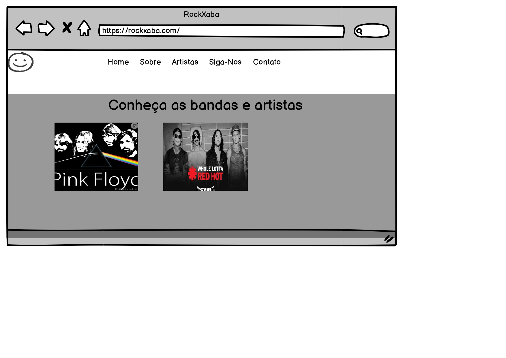 

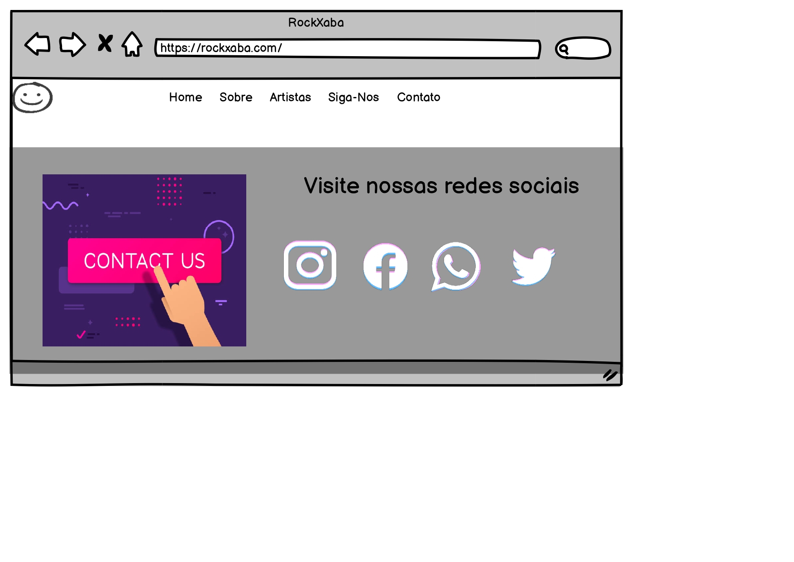 

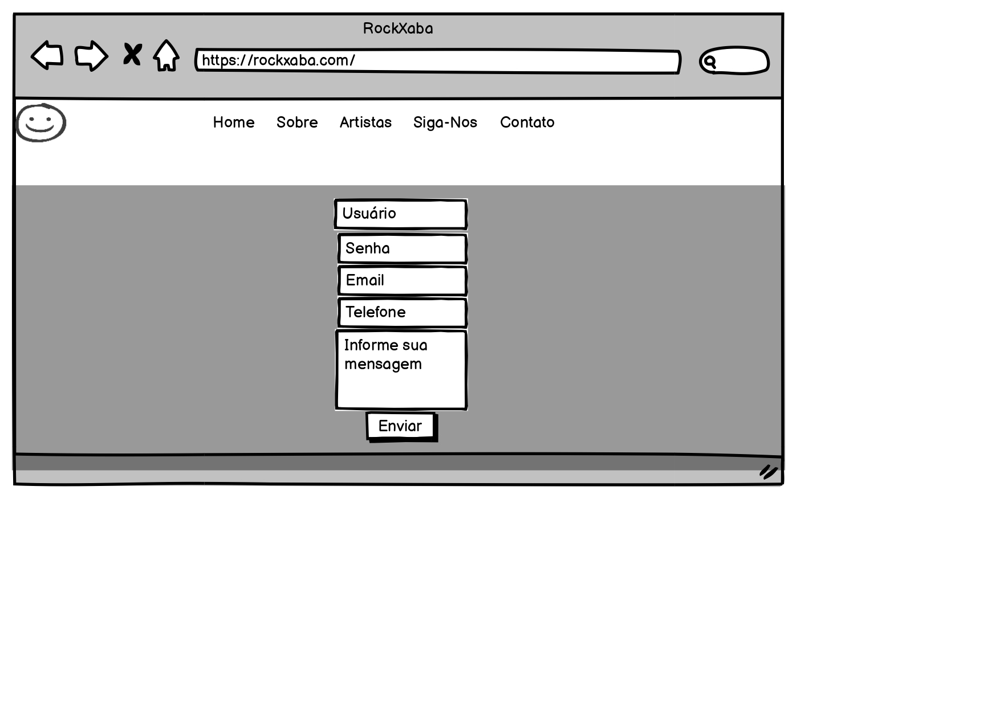 

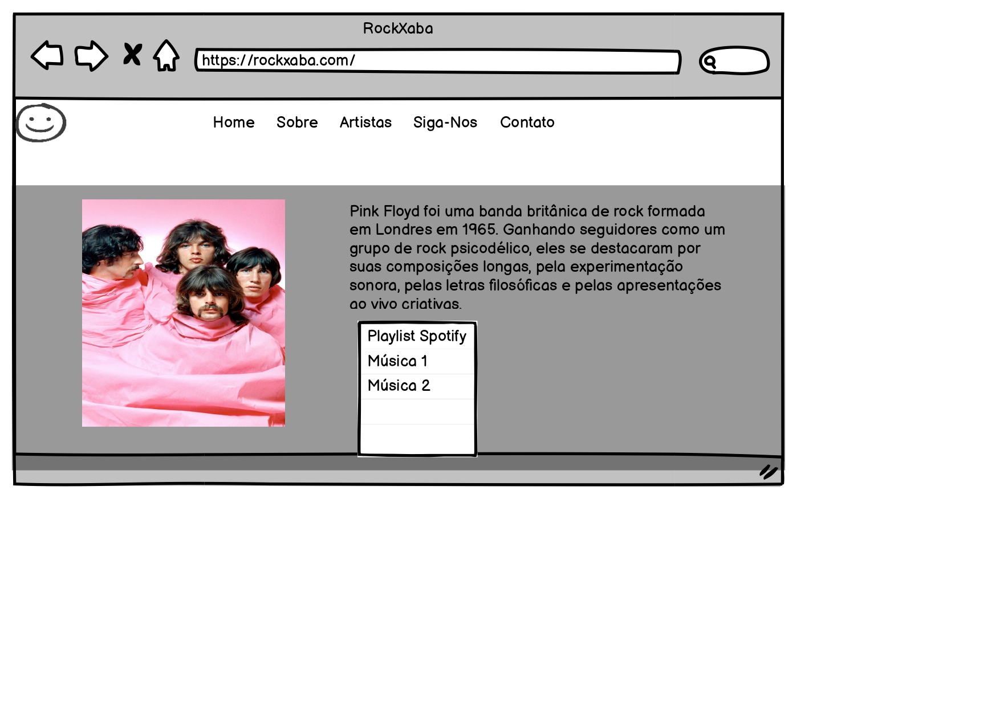 

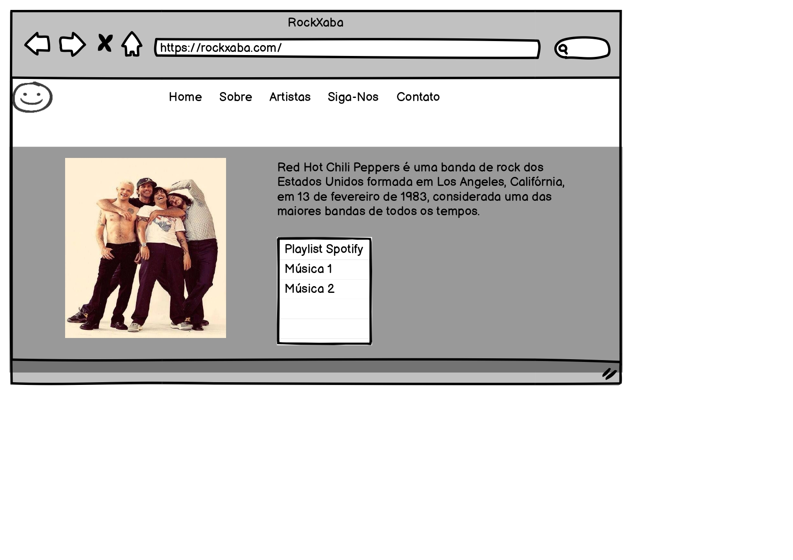 

#### 5.1 QUAIS PERGUNTAS PODEM SER RESPONDIDAS COM O SISTEMA PROPOSTO?

    a) O sistema proposto poderá fornecer quais tipos de relatórios e informações?
    
    O sistema proposto poderá fornecer relatórios e informações com relação ao usuário, seu nome, seu email, sua senha, o id a ele atribuido, e seu tipo 
    dentro do site (podendo ser comum, artista, administrador e adiministrador_artista). Poderá também fornecer relatórios quanto ao número de artistas,
    seu nome, gênero musical, descrição, playlist e catálogo, e os produtos que nele estão. Pode fornecer relatórios referentes aos produtos comprados, 
    e aos  eventos adicionados ao site
    
    b) Crie uma lista com os 5 principais relatórios que poderão ser obtidos por meio do sistema proposto!
   * Relatório com a quantidade de usuários cadastrados no site, incluindo as seguintes informações: id do usuário, nome, email, senha e tipo
   * Relatório com a quantidade de artistas cadastrados no site, incluindo as seguintes informações: id do artista, nome, descrição, gênero musical e link de    sua playlist de músicas e id do usuário ligado a ele
   * Relatório do número de catálogos de artistas cadastrados no site, incluindo as seguintes informações: id do catálogo e id do artista ao qual ele            pertence
   * Relatório do número de produtos presentes em cada catálogo e daqueles que foram comprados, incluindo as seguintes informações: id do produto, nome do      produto, descrição do produto, preço do produto, código da compra e data da compra
   * Relatório dos eventos adicionados ao site, incluindo as seguintes informações: id do evento, data do evento, descrição do evento, local do evento,          descrição do evento, data do início da venda dos ingressos e data limite da venda de ingressos
 

### 6. TABELA DE DADOS DO SISTEMA:
    
  ### Link da tabela
  https://docs.google.com/spreadsheets/d/1qAd4MRqutDYQ0STj_ZWVn1yk-ysUNSTcT1-sfBa1qvo/edit?usp=sharing
  
 

 

 
 
 ### 7.MODELO CONCEITUAL 
    
     Principais entidades do sistema em desenvolvimento: Usuário, Artista e Evento
 
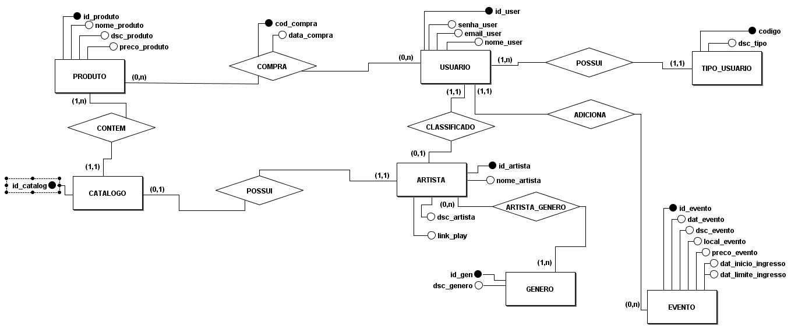 
      
    
#### 7.1 Descrição dos dados 
    
USUÁRIO: Tabela que armazena os dados do usuário. 
id_user: campo que armazena o id do usuário.  
senha_user: campo que armazena a senha do usuário.  
email_user: campo que armazena o email do usuário.  
nome_user: campo que armazena o nome do usuário.  
FK_TIPO_USUARIO_codigo: campo que armazena e determina o tipo de usuário.  

TIPO_USUÁRIO: Tabela que armazena os tipos de usuário.  
codigo: campo que armazena o código referente a cada tipo de usuário.  
dsc_tipo: descrição do tipo de usuário.  

ARTISTA: Tabela que armazena os dados do artista.  
id_artista: campo que armazena o id do artista.     
nome_artista: campo que armazena o nome do artista.     
dsc_artista: campo que armazena a descrição do artista.     
link_play: campo que armazena o link para o Spotify do artista. 
FK_USUARIO_id_user: chave estrangeira referente ao tipo de usuário. 

ARTISTA_GENERO: Tabela que relaciona um artista a um gênero. 
FK_GENERO_id_gen: chave estrangeira com o gênero musical.     
FK_ARTISTA_id_artista: chave estrangeira com o id do artista. 

GENERO: Tabela que armazena o id e gênero musical dos artistas.  
id_gen: campo que armazena o id referente ao gênero. 
dsc_gen: campo que armazena a descrição do gênero. 

CATALOGO: Tabela que armazena o catálogo referente a cada artista. 
id_catalog: campo que armazena o id do catálogo.     
FK_ARTISTA_id_artista: chave estrangeira que armazena o id do artista. 

PRODUTO: Tabela que armazena os produtos referentes ao catálogo de cada artista.  
id_produto:    campo que armazena o id do produto. 
nome_produto: campo que armazena o nome do produto.     
dsc_produto:    campo que armazena a descrição do produto. 
preco_produto: campo que armazena o preço do produto.     
FK_CATALOG_id_catalog: chave estrangeira referente ao id do catálogo que o produto pertence.  

COMPRA: Tabela que armazena os dados da compra de um usuário.  
FK_PRODUTO_id_produto: chave estrangeira referente ao id do produto que foi comprado.      
FK_USUARIO_id_user: chave estrangeira referente ao id do usuário que realizou a compra.     
cod_compra:    campo que armazena o código da compra.  
data_compra: campo que armazena a data em que a compra foi realizada.

EVENTO: Tabela que armazena os dados do evento.  
id_evento: campo que armazena o id do evento.   
dat_evento: campo que armazena a data do evento.     
dsc_evento: campo que armazena a descrição do evento.  
local_evento: campo que armazena    o local do evento.  
preco_evento: campo que armazena     o preço do ingresso.  
dat_limite_ingresso: campo que armazena a data final da venda do ingresso.  
dat_inicio_ingresso: campo que armazena a data inicial da venda do ingresso.  
FK_USUARIO_id_user: chave estrangeira relativa ao id do usuário que adicionou o evento.  

### 8	RASTREABILIDADE DOS ARTEFATOS 
        a) Historia de usuários vs protótipo (mockup)
        
   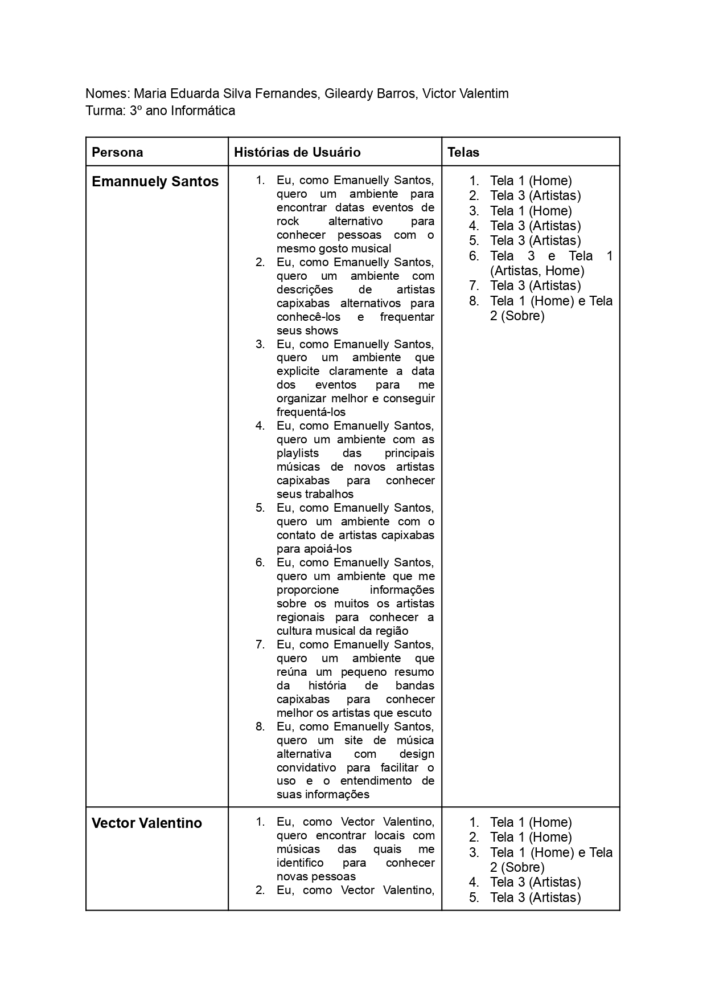 
        

        
   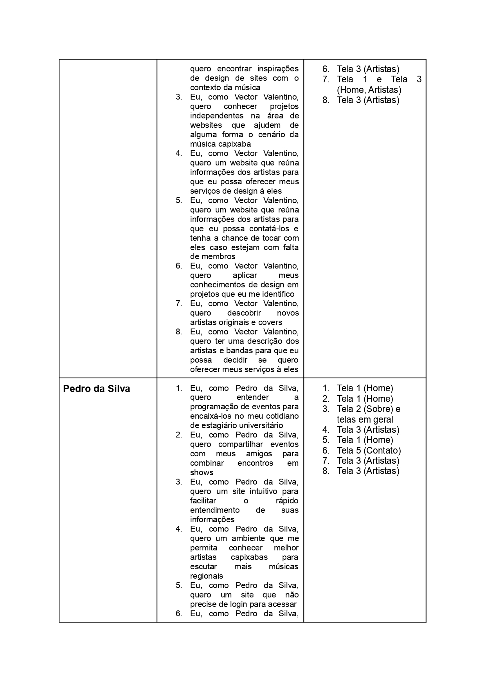 
        
    
        
        
        b) Protótipo vs Modelo conceitual
        https://docs.google.com/document/d/14xMxds2hX2hrbi7a-_bTq8QeyV_rjLOzAJpNfi_d4PM/edit
        
        (não serão aceitos modelos que não estejam em conformidade)
        c) Backlog (caso solicitado)

### 9	MODELO LÓGICO 
        a) inclusão do esquema lógico do banco de dados
        b) verificação de correspondencia com o modelo conceitual 
        (não serão aceitos modelos que não estejam em conformidade)

### 10	MODELO FÍSICO 
        a) inclusão das instruções de criacão das estruturas em SQL/DDL 
        (criação de tabelas, alterações, etc..) 
       
### 11	INSERT APLICADO NAS TABELAS DO BANCO DE DADOS 
        a) inclusão das instruções de inserção dos dados nas tabelas criadas pelo script de modelo físico
        (Drop para exclusão de tabelas + create definição de para tabelas e estruturas de dados 
   + insert para dados a serem inseridos)
        b) Criar um novo banco de dados para testar a restauracao 
        (em caso de falha na restauração o grupo não pontuará neste quesito)
        c) formato .SQL

### 12	TABELAS E PRINCIPAIS CONSULTAS 
    OBS: Incluir para cada tópico as instruções SQL + imagens (print da tela) mostrando os resultados. 
#### 12.1	CONSULTAS DAS TABELAS COM TODOS OS DADOS INSERIDOS (Todas)  
#### 12.2 PRINCIPAIS CONSULTAS DO SISTEMA 
 Inserir as principais consultas (relativas aos 5 principais relatórios) definidas previamente no iten 3.1 deste template.
  
  a) Você deve apresentar as consultas em formato SQL para cad um dos relatórios.
  
  b) Além da consulta deve ser apresentada uma imagem com o resultado obtido para cada consulta. 
 #### 12.3 ANTEPROJETO VERSÃO 1
 
 Link para [Modelo de Anteprojeto](https://docs.google.com/document/d/1oeVS2CUffbSNYWxIWZFY_mX6E5ao_PHU/edit?usp=sharing&ouid=104104747195236161434&rtpof=true&sd=true)
 
  
  
 
 
 
 
 ### 13 Gráficos, relatórios, integração com Linguagem de programação e outras solicitações. 
     OBS: Observe as instruções relacionadas a cada uma das atividades abaixo. 
 #### 13.1	Integração com Linguagem de programação;  
 #### 13.2	Desenvolvimento de gráficos/relatórios pertinentes, juntamente com demais  
 #### solicitações feitas pelo professor.  
 #### 13.3 ANTEPROJETO VERSÃO 2
  
  
 
 
 ### 14 Slides e Apresentação em vídeo.  
     OBS: Observe as instruções relacionadas a cada uma das atividades abaixo. 
 #### 14.1 Slides;  
 #### 14.2 Apresentação em vídeo  
 #### 14.3 ANTEPROJETO VERSÃO FINAL
  
     

    
##### About Formatting
    https://help.github.com/articles/about-writing-and-formatting-on-github/
    
##### Basic Formatting in Git
    
    https://help.github.com/articles/basic-writing-and-formatting-syntax/#referencing-issues-and-pull-requests
   
    
##### Working with advanced formatting
    https://help.github.com/articles/working-with-advanced-formatting/

#### Mastering Markdown
    https://guides.github.com/features/mastering-markdown/

### OBSERVAÇÕES IMPORTANTES

#### Todos os arquivos que fazem parte do projeto (Imagens, pdfs, arquivos fonte, etc..), devem estar presentes no GIT. Os arquivos do projeto vigente não devem ser armazenados em quaisquer outras plataformas.
1. Caso existam arquivos com conteúdos sigilosos, comunicar o professor que definirá em conjunto com o grupo a melhor forma de armazenamento do arquivo.

#### Todos os grupos deverão fazer Fork deste repositório e dar permissões administrativas ao usuário deste GIT, para acompanhamento do trabalho.

#### Os usuários criados no GIT devem possuir o nome de identificação do aluno (não serão aceitos nomes como Eu123, meuprojeto, pro456, etc). Em caso de dúvida comunicar o professor.

Link para BrModelo: 
http://sis4.com/brModelo/brModelo/download.html
 

Link para curso de GIT 

